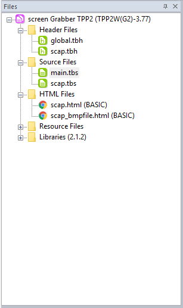
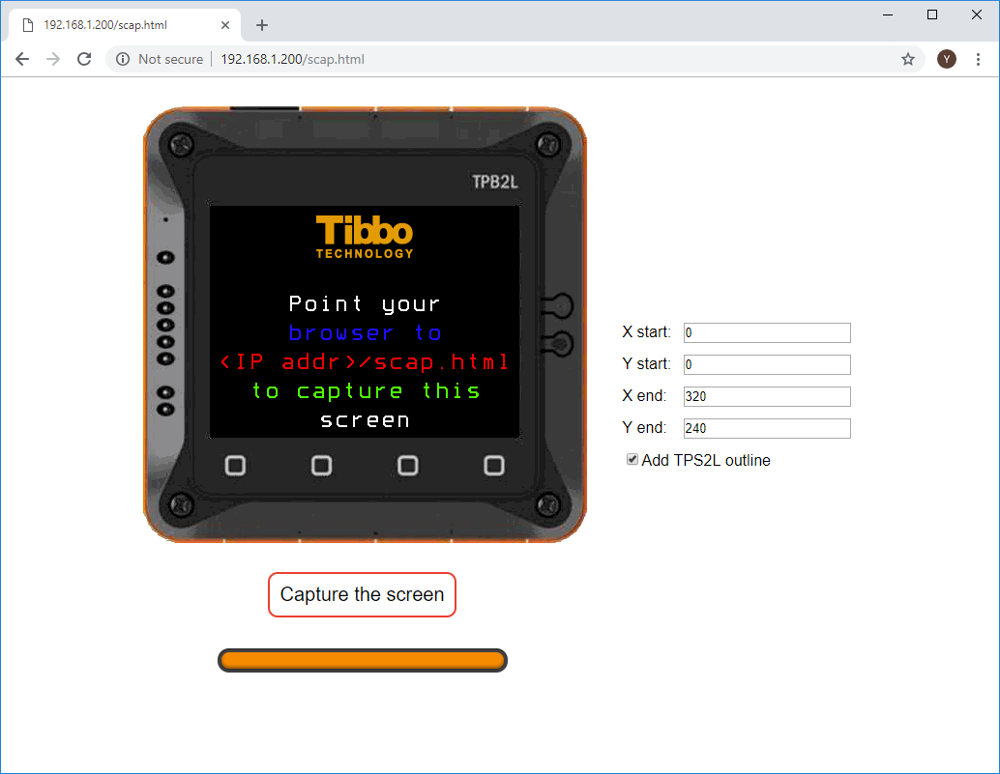
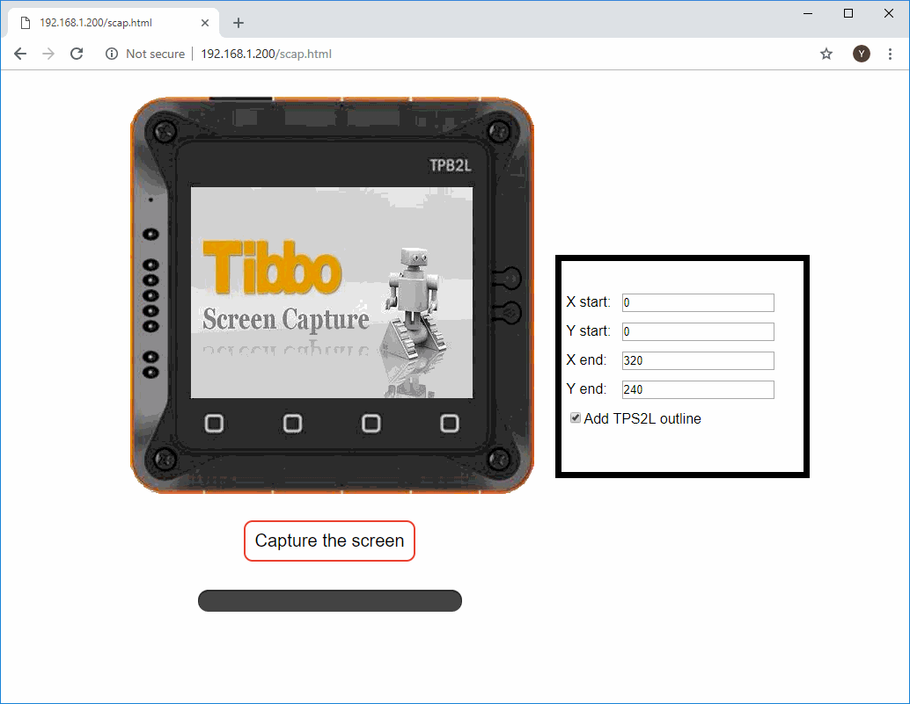

# TPS2L_SCREEN_CAPTURE

Ever had to produce high-quality images of your device's LCD screen? This need often arises when you are working on web pages or user manuals describing your product's functionality. If you ever tried taking photos of LCD screens with a camera, you know that the result always looks somewhat skewed, over- or under-exposed, and amateurish.

Tibbo [SCAP library](http://docs.tibbo.com/taiko/index.html?lib_scap.htm) to the rescue! This library adds screen-grabbing to your Tibbo BASIC/C app.

This project allows you to test the library on a TPS2L(G2) device.
To take a screenshot, point the browser to _http://<your device's IP address>/scap.html_ and click **Capture the Screen**. The app even adds a TPS2L "frame" around the screenshot.

## Testing Notes

Before testing, set the suitable IP address (**net.ip="...** in **on_sys_init()** of **main.tbs**).


   **Note:**
   Make sure that both html files are in basic type.

   If the html files are not in BASIC type right click on each file and select **change file type** and from the popup window change the Type to **HTML file (BASIC)**.

   

## How To Use The Library

In order to use the library the following steps has to be made after placing the required files in the project and including  **screengrabber.tbh** in the global header file.

### Step 1: Define the required preprocessors:

The required preprocessors are,If these preprocessors are not defined the following is the default values :

```basic
#define SCREENSHOT_INTERFACE "NET" 'definitions is the same as sock.allowedinterfaces
#define SCREENGRABBER_HTTP_TX_BUFF_PAGES 8 
#define SCREENGRABBER_HTTP_VAR_BUFF_PAGES 2
```

### Step 2: Initializing the library:

In order to initialize the library the following code snippet has to be wrote on_sys_init

​	**Note:**
​	Make sure to change the IP ADDRESS to a suitable one.

```basic
net.ip="192.168.1.200"	'<======== SET A SUITABLE IP ADDRESS

if scap_start()<>EN_SCAP_STATUS_OK then
    sys.debugprint("Could not allocate the required number of sockets")
    sys.halt
end if

```

For this library to work the device has to be assigned an IP address according to the interface that will be used either by using the DHCP library or a static IP address.

### Step 3: Using the Library:

To use this library open the following link on the web browser: 192.168.1.200/screengrabber.html

**In the URL replace 192.168.1.200 with the device IP address**

After opening the previous link the following screen will show click Capture the screen to start the screenshot process and The progress bar will show the screen captureprogress 


The screenshot progress can take up to one minute, The progress bar will show the screen capture progress. 

​	

After The screen capture is finished the screen will appear. 



### Step 4: Cropping and showing the device outline:

If it is required to crop the captured screen adjust the start point and end point of the required picture and then click Capture, If it is required to remove the device from the picture and just show the captured screen uncheck **Add TPS2L outline**


