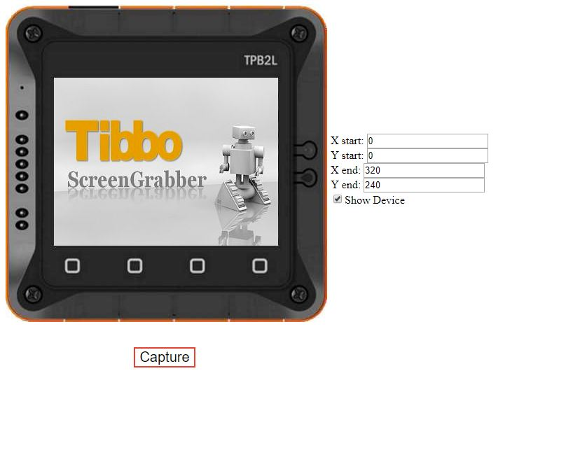
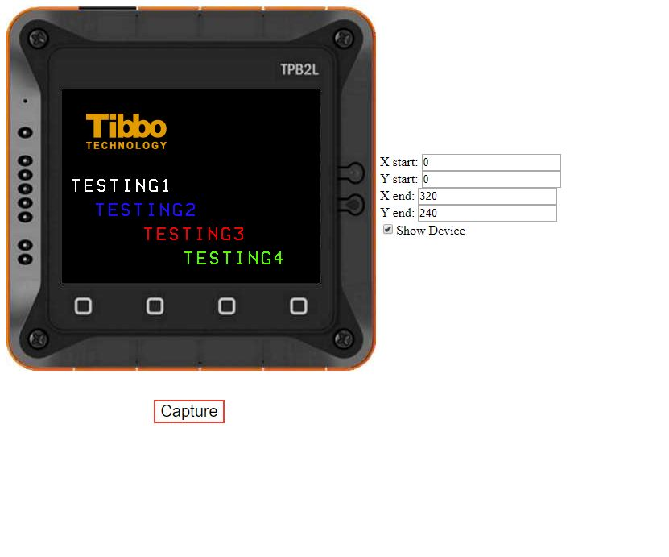
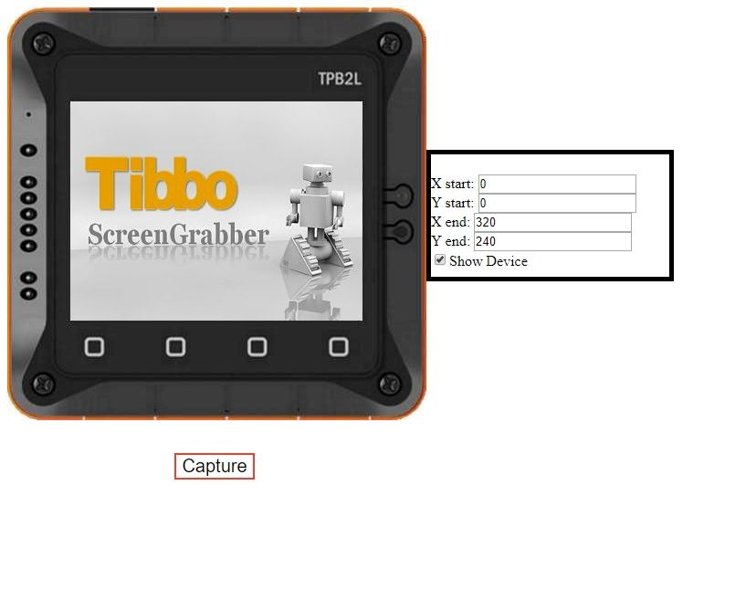

# TPS2L_SCREEN_CAPTURE

To download the most recent project without installing GIT, please press the green "Clone or Download" button and select "Download ZIP".

## About the Application

This download contains the library required to be able to get screenshots from the TPb2L LCD through a browser.

---

## Required files

The files that is required to be included in the project are:

1. screengrabber.tbs

2. screengrabber.tbh

3. screengrabber.html

4. bmpfile.html

5. socket library

   **Note:**
   Make sure that both html files are in basic type.

   If the html files are not in BASIC type right click on each file and select **change file type** and from the popup window change the Type to **HTML file (BASIC)**.

   

## How To Use The Library

In order to use the library the following steps has to be made after placing the required files in the project and including  **screengrabber.tbh** in the global header file.

### Step 1: Define the required preprocessors:

The required preprocessors are,If these preprocessors are not defined the following is the default values :

```basic
#define SCREENSHOT_INTERFACE "NET" 'definitions is the same as sock.allowedinterfaces
#define SCREENGRABBER_HTTP_TX_BUFF_PAGES 8 
#define SCREENGRABBER_HTTP_RX_BUFF_PAGES 2 
#define SCREENGRABBER_HTTP_VAR_BUFF_PAGES 2
```

### Step 2: Initializing the library:

In order to initialize the library the following process has to be called **After obtaining a valid IP address **

```basic
declare sub screengrabber_http_sock_init(num_of_socks as byte )
'For this library to work an IP address has to be assigned to the device
'sock library has to be used 
'The HTTP has to have several sockets therefore the amount of sockets that will be used should be passed

```

For this library to work the device has to be assigned an IP address according to the interface that will be used either by using the DHCP library or a static IP address (not recommended).

### Step 3: Using the Library:

To use this library open the following link on the web browser: 192.168.1.230/screengrabber.html

**In the URL replace 192.168.1.230 with the device IP address**

After opening the previous link the following screen will show click Capture to start the screenshot process and wait till it finish. 



After clicking Capture wait for 16~20 seconds until the screenshot is finished 

After the screenshot finish the screen will appear as following and repeat whenever required



### Step 4: Cropping and showing the device:

If it is required to crop the captured screen adjust the start point and end point of the required picture and then click Capture, If it is required to remove the device from the picture and just show the captured screen uncheck **show device**


